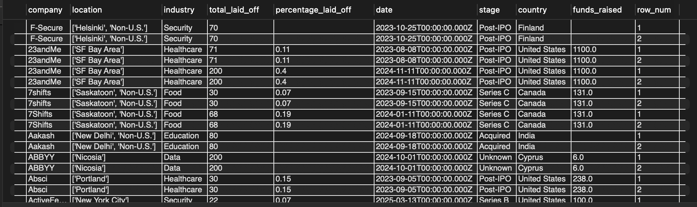
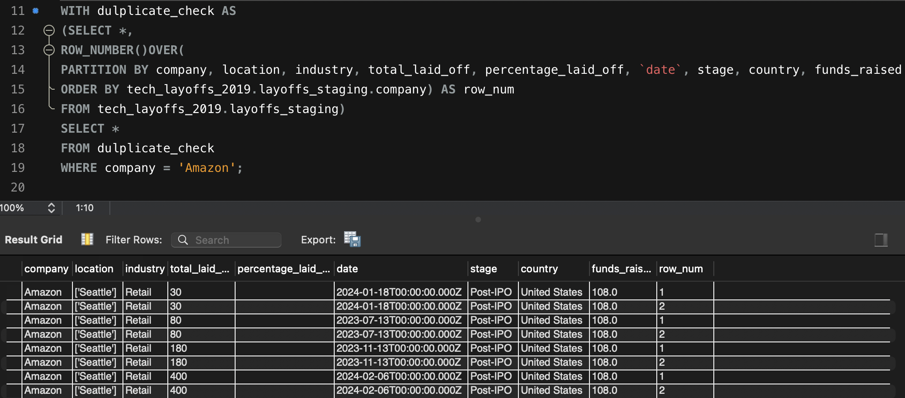
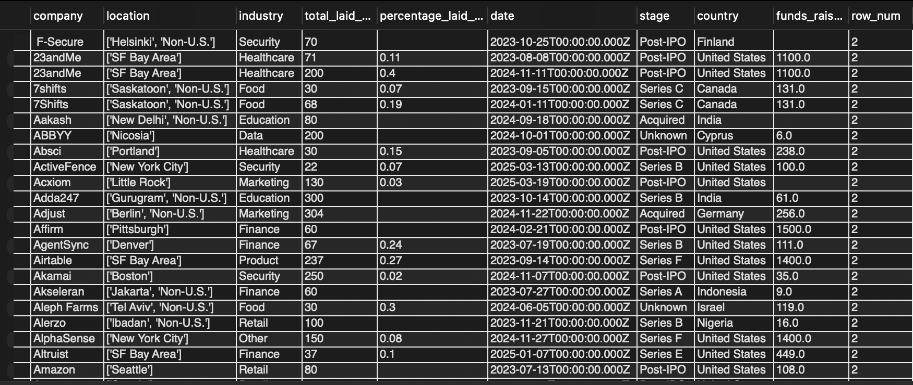
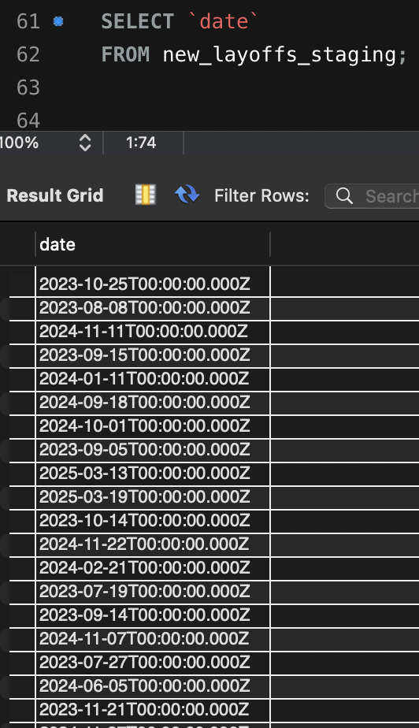
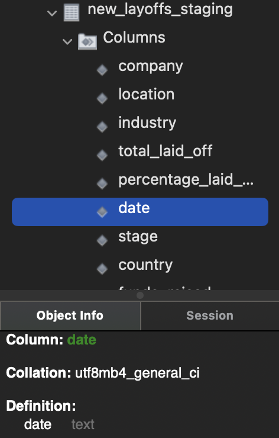
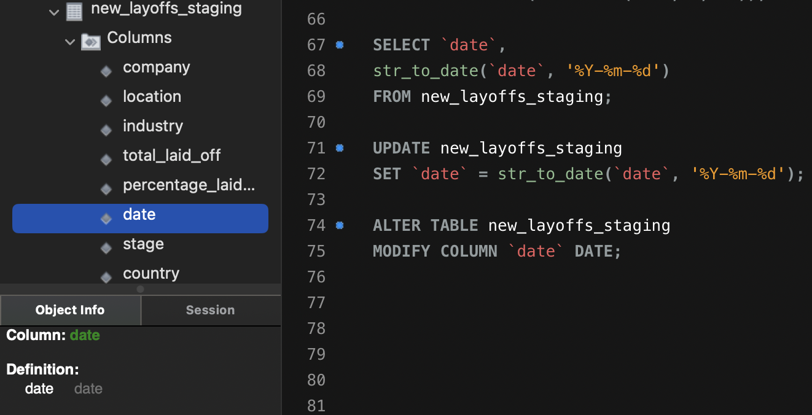

# Welcome to my SQL Data Cleaning Project

##Introduction
This project demonstrates a practical data cleaning process performed in MySQL on a dataset tracking technology sector layoffs. The primary goal was to transform the raw data into a reliable and consistent format suitable for analysis. Please find the dataset named layoffs.csv in the files above or go to https://www.kaggle.com/datasets/swaptr/layoffs-2022.


## Requirements:
1. Remove Duplicates (if any)
2. Standardize the data 
3. Deal with null Values or blank values
4. Remove columns or rows (if necessary) using a staging table

It's advisable not to make changes directly in the raw data file, so we'll create a new staging file inside our database.
```sql
CREATE TABLE tech_layoffs_2019.layoffs_staging
LIKE tech_layoffs_2019.layoffs;
```

Now, we'll insert all the data within layoffs into layoffs_staging
```sql
INSERT tech_layoffs_2019.layoffs_staging
SELECT *
FROM tech_layoffs_2019.layoffs ;
```
Let's use the window function in order to identify duplicate data in our table
```sql
SELECT *,
ROW_NUMBER()OVER(
PARTITION BY company, location, industry, percentage_laid_off, `date`, stage, country 
ORDER BY tech_layoffs_2019.layoffs_staging.company) AS row_num
FROM tech_layoffs_2019.layoffs_staging;
```


Another way to check is also via taking a company entry as follows:



We can clearly see under row_num column that there are dulplicate rows. However, if we want to be really sure about duplicate data and to practice our SQL we can use common table expressions (CTE) as follows:
```sql
WITH duplicate_check AS
(SELECT *,
ROW_NUMBER()OVER(
PARTITION BY company, location, industry, percentage_laid_off, `date`, stage, country 
ORDER BY tech_layoffs_2019.layoffs_staging.company) AS row_num
FROM tech_layoffs_2019.layoffs_staging)
SELECT *
FROM duplicate_check
WHERE row_num > 1;
```


Now we're absolutely sure that duplicate rows does exist however, directly deleting rows identified by a CTE is not supported in MySQL. Therefore, we will create a second staging table (new_layoffs_staging). This table will include the calculated row_num, allowing for a straightforward DELETE statement to remove the duplicate rows based on row_num > 1."
```sql
ALTER TABLE new_layoffs_staging
ADD COLUMN row_num INT;

INSERT INTO new_layoffs_staging
SELECT *,
ROW_NUMBER()OVER(
PARTITION BY company, location, industry, total_laid_off, percentage_laid_off, `date`, stage, country, funds_raised 
ORDER BY tech_layoffs_2019.layoffs_staging.company) AS row_num
FROM tech_layoffs_2019.layoffs_staging;
```
Although it's the perfect time to delete duplicate data in our new table, we will first run the SELECT command and then do DELETE to implement best practice.
```sql
SELECT *
FROM new_layoffs_staging
WHERE row_num > 1;

DELETE 
FROM new_layoffs_staging
WHERE row_num > 1;
```

We need to do the text formatting of company column hence we can use TRIM and UPADATE it after.
```sql
SELECT company, TRIM(company)
FROM new_layoffs_staging;

UPDATE new_layoffs_staging
SET company = TRIM(company);
```

For other columns as well, we can check if there are some entries that need to be taken care of, perhaps by TRIM or an unnecessary character etc. In this dataset, all entries look good.
```sql
SELECT  DISTINCT industry
FROM new_layoffs_staging
ORDER BY industry;
```

Coming to the date column, we see that date is a text and not in date data structure (we can do that when we upload the file in our MySQL workspace) and that there are unnecessary timezone succeeding the date all with exactly same value.



Now, using substring we trim the unwanted part of the data as well as alter the date column with DATE data type.
```sql
UPDATE new_layoffs_staging
SET `date`= TRIM(SUBSTRING(date, 1, 10));

SELECT `date`,
str_to_date(`date`, '%Y-%m-%d')
FROM new_layoffs_staging;

UPDATE new_layoffs_staging
SET `date` = str_to_date(`date`, '%Y-%m-%d');

ALTER TABLE new_layoffs_staging
MODIFY COLUMN `date` DATE;
```


Our purpose of removing duplicating data is done, hence we can DROP the row_num column.
```sql
ALTER TABLE new_layoffs_staging
DROP row_num;
```
If we want, we can handle null values or empty spaces, the usual approach is to rename or convert any existing empty string to NULL data type or TRIM empty string and rename it to "Unknown". We can go column by column to find out which rows have these values.
```sql
SELECT *
FROM new_layoffs_staging
WHERE percentage_laid_off IS NULL OR percentage_laid_off = '';


SELECT industry,
CASE
	WHEN industry = '' THEN NULL 
	ELSE industry         
END AS industry_cleaned
FROM new_layoffs_staging;
```
We can and should do this for other columns as well.
